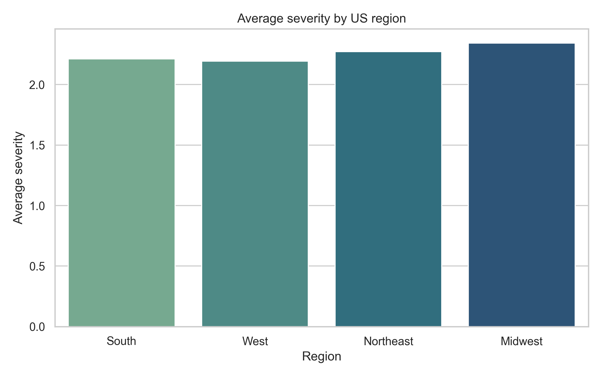
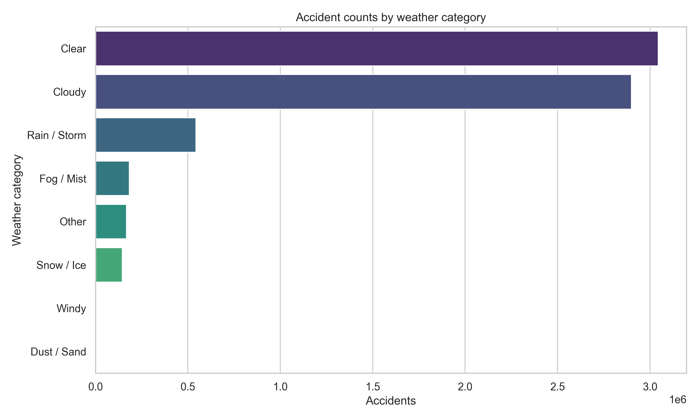
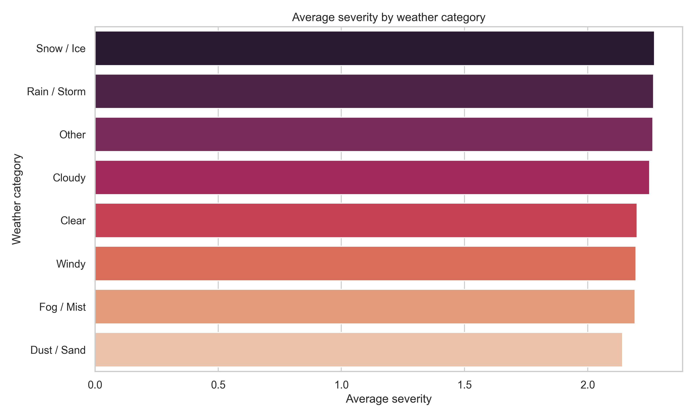
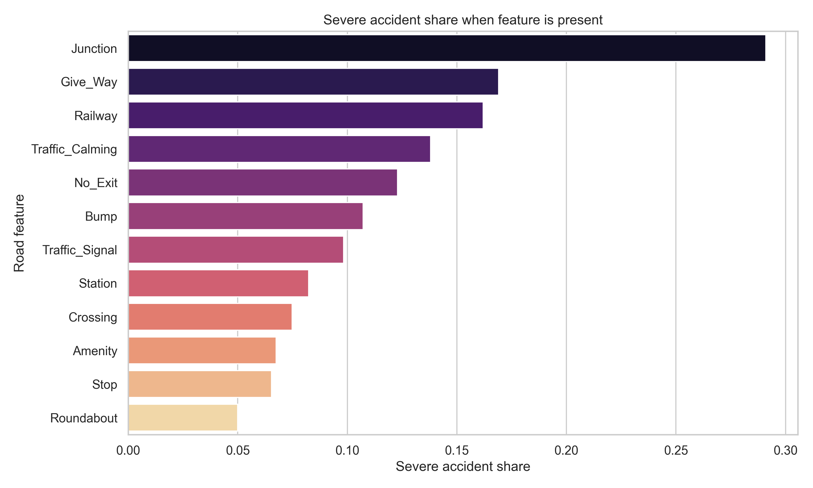
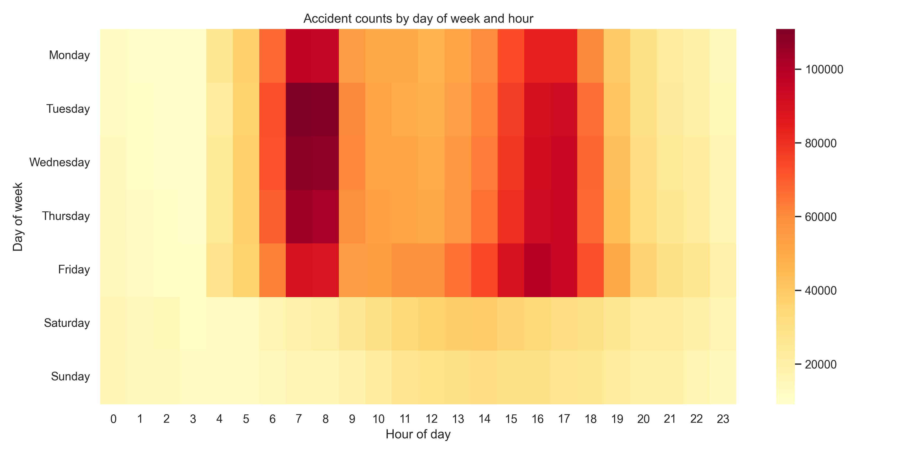
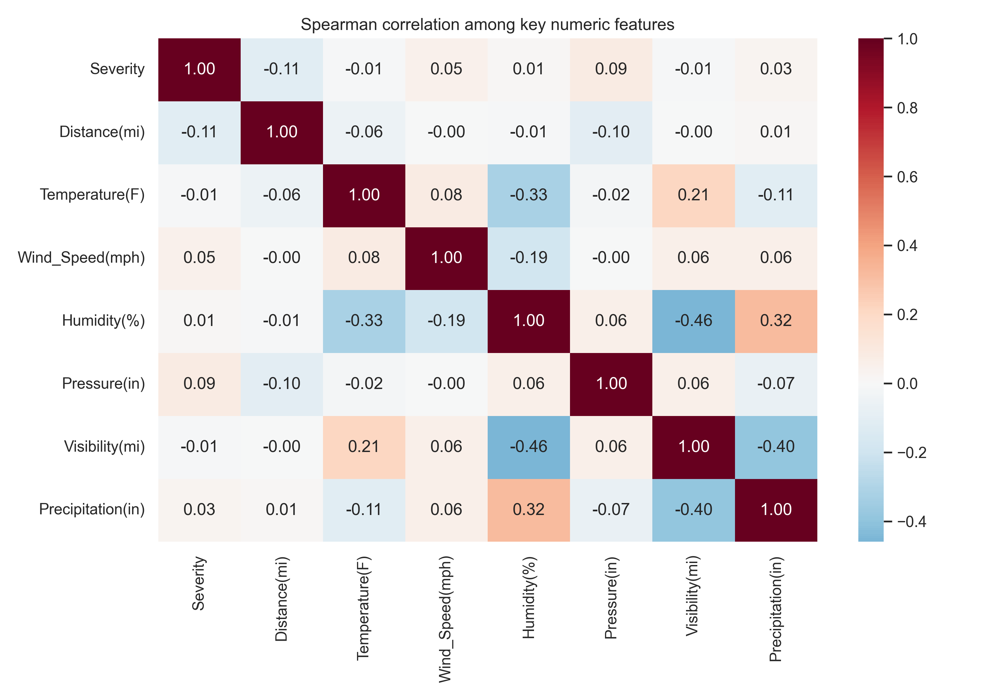

<!-- _class: lead -->
# DataTransitt
## Análise de Acidentes de Trânsito nos EUA

- Kaggle US Accidents Dataset
- Download, limpeza e visualizações automatizadas
- Foco em fatores climáticos, regionais e de infraestrutura

---

## Objetivos

- Identificar padrões de gravidade em diferentes regiões
- Investigar influência de clima e características viárias
- Criar visualizações estáticas e interativas reproducíveis

---

## Pipeline

1. `analysis.py` baixa e atualiza o dataset
2. Limpeza e engenharia de variáveis chave (clima, região, infraestrutura)
3. Geração de tabelas `outputs/tables/`
4. Plotagens em `outputs/plots/` e visualizações interativas em `outputs/interactive/`

---

## Principais Insights

- Midwest com maior severidade média (~2,34) e 31% de acidentes graves
- Condições Rain / Storm e Cloudy elevam gravidade frente a tempo Clear
- Terças e quartas entre 7h-8h concentram mais ocorrências
- Eventos em `Junction` apresentam ~29% de severidade alta

---

## Severidade por Região

---

## Clima e Gravidade

---

## Clima e Severidade

---

## Pontos Críticos na Infraestrutura

---

## Ritmo Temporal

---

## Variáveis Correlacionadas

---

## Requisitos e Execução

- Python 3.10+, `kagglehub`, `pandas`, `seaborn`, `matplotlib`, `plotly`
- Instalação: `pip install -r requirements.txt`
- Execução rápida: `python analysis.py`
- Resultados completos em `outputs/`

---

## Próximos Passos

- Integrar alertas para novas versões do dataset
- Explorar modelos preditivos de severidade
- Publicar painel interativo com atualizações automáticas
